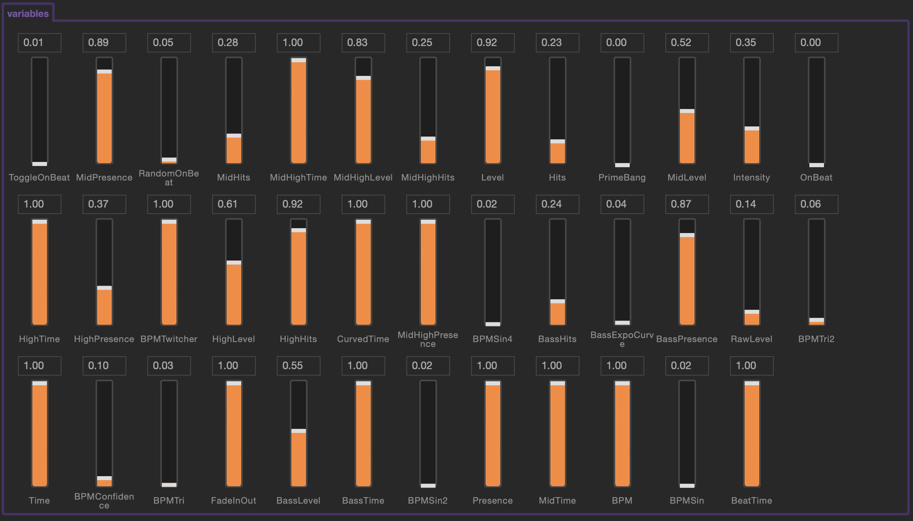

# Synesthesia Ecosystem

This is a place to share, discuss, request, track, and provide feedback for community efforts, tools, guides, etc., for [Synesthesia](https://synesthesia.live).

The enhancement issues are not meant to be implemented here, but they can link to the implementation, discussions, further descriptions, etc. The main idea with the tag is to provide an overview of feature suggestion and ease collaboration for anyone who wants to help or are already implementing the features.

## Contributing

The simplest way to contribute is to join the discussion in the existing [Discord community](https://discord.gg/dMVvCgXxtU) in the #tools and other #channels, or in [this repo's discussion tab](https://github.com/mattorp/synesthesia-ecosystem/discussions).

Other ways are to

- ask for, list, describe, expand on, ..., features/resources/ideas in the [issues](https://github.com/mattorp/synesthesia-ecosystem/issues)
- edit this file
- or add new files for more in-depth information.

The #feature-suggestions channel in [Discord](https://discord.gg/dMVvCgXxtU) may prove an inspiration. Some of these features can be implemented outside Synesthesia, which lets the team focus on core features instead.

## Table of Contents

- [Contributing](#contributing)
- [Table of Contents](#table-of-contents)
- [Shaders](#shaders)
  - [Libraries](#libraries)
  - [Guides](#guides)
  - [Show variables](#show-variables)
- [YouTube channels](#youtube-channels)
- [Art style](#art-style)
  - [Glitch Art](#glitch-art)
- [Tools](#tools)
  - [Texture sharing](#texture-sharing)
  - [Audio sharing](#audio-sharing)
  - [VSCode extensions](#vscode-extensions)
  - [Scripts](#scripts)
  - [APIs](#apis)
- [Projects](#projects)
  - [Games](#games)
- [Running on Linux](#running-on-linux)
- [FAQ](#faq)
- [Footnotes](#footnotes)

## Shaders

### Libraries

- [Shadertoy](https://www.shadertoy.com)

### Guides

- [Synesthesia Resources](https://synesthesia.live/docs/resources/syn_resources.html)
- [The Book of Shaders](https://thebookofshaders.com)
  > This is a gentle step-by-step guide through the abstract and complex universe of Fragment Shaders.
- [The principles of painting with maths](https://www.youtube.com/watch?v=0ifChJ0nJfM)
- [The Art of Code](https://www.youtube.com/channel/UCcAlTqd9zID6aNX3TzwxJXg)
- [Inigo Quilez](https://www.iquilezles.org/index.html)
- [Daniel Shiffman](https://shiffman.net)
- [Alan Zucconi](https://www.alanzucconi.com)
   >Answers a lot of questions I've had about shiny shit
   >
   > \- @uFFFD

### Show variables

Version 1.19 included the ability to set controls from the javascript file. This allows visualising values in the controller view.


For the built in Synesthesia variables add these to your `script.js` and `scene.json` files:

- [script.js](scene-development/showVariables/script.js)
- [scene.json](scene-development/showVariables/scene.json)

This can be used to visualise any value, including combined values, e.g. `Math.sin(TIME)+Math.tan(OnBeatTime)`.

## YouTube channels

- [Synesthesia Live](https://www.youtube.com/channel/UCN91NOZFK06VxOMbFw_-E2g/)
- [allmyfriendsaresynths](https://www.youtube.com/c/allmyfriendsaresynths)
- [YOVOZOL](https://www.youtube.com/c/Yovozol)
- [Purple Bee TV](https://www.youtube.com/c/PurpleBeeTV)
- [The Coding Train](https://www.youtube.com/thecodingtrain)
- [Entagma](https://www.youtube.com/c/Entagma)

## Art style

### Glitch Art

- [Circuit Bending a Video Mixer for Glitch Art by allmyfriendsaresynths](https://www.youtube.com/watch?v=AM8H7nDEtRc)
- [Broken Unicode by UFFFD](https://ufffd.com/zalgo/)

## Tools

- [OBS](https://obsproject.com)
  - [/help](https://obsproject.com/help)
- [Resolume](https://resolume.com/)

  - [/training](https://resolume.com/training)
  - [/avenue-arena](https://resolume.com/support?avenue-arena)
  - [/wire](https://resolume.com/support?wire)
- [MadMapper](https://madmapper.com)
  - [/youTube](https://www.youtube.com/channel/UCC9p0fzuYik453n9fXFjpgg)
  - [garageCube](http://forum.garagecube.com/viewforum.php?f=31)
- [TouchDesigner](https://derivative.ca)
  - [/learn](https://derivative.ca/learn)
- [Houdini](https://www.sidefx.com)
  - [/tutorials](https://www.sidefx.com/tutorials/)
- [OctaneRender](https://home.otoy.com/render/octane-render/)
  - [/portal](https://docs.otoy.com/Portal/Home.htm)

### Texture sharing

With these tools you can send video from one application to another.

[Spout](#spout) and [Syphon Recorder](#syphon-recorder) are more performant [^more-performant]. For remote sharing, you can use [NDI](#ndi).

  [^more-performant]: _more performant_: [Syphon/Spout happens on the GPU, where as NDI forces the GPU to sync with the CPU](https://discord.com/channels/729824270913503374/904193890452660224/905209251574734909)

- [Spout](https://spout.zeal.co)
- [Syphon Recorder](http://syphon.v002.info)
- [NDI](https://www.ndi.tv)

  - [/ndi-developer-zone](https://forums.newtek.com/forums/ndi-developer-zone.363/)

### Audio sharing

- [Sound Siphon](https://staticz.com/soundsiphon/)

### VSCode extensions

- [glsl-canvas](https://marketplace.visualstudio.com/items?itemName=circledev.glsl-canvas)
  > The extension opens a live WebGL preview of GLSL shaders within VSCode by providing a Show glslCanvas command.
  - _glsl canvas requires small adjustments to the file, which will be solved by [#3][i3]._
- [snippets](https://marketplace.visualstudio.com/items?itemName=synesthesia.synesthesia-snippets)

[i3]: https://github.com/mattorp/synesthesia-ecosystem/issues/3

### Scripts

- [synesthesia-scripts](https://github.com/headstash/synesthesia-scripts)
  >Code generation utilities for developing Synesthesia scenes.
- [benchmarking (draft)][i50]

[i50]: https://github.com/mattorp/synesthesia-ecosystem/issues/50

### APIs

- [syn-server](https://github.com/mattorp/syn-server)
  >This functions as a REST endpoint to communicate with Synesthesia.

## Projects

### Games

- [syn-games](https://github.com/mattorp/syn-games)
  >A suite of tools that allow various interactions with Synesthesia with the goal of creating new types of games: Sports, board games, language learning, song/music lessons, etc.
  - _This repo will be refactored into smaller packages soon, and the documentation improved._

## Running on Linux

It's possible to let Synesthesia run on Linux via Wine. It was tested on Arch Linux (on 2021-01-07) with Synesthesia (versions `1.18.1.42` and `1.19.0.51`), Wine (version `7.0rc4-1`) and an NVIDIA GeForce GT 730 (and the NVIDIA drivers in version `470.94-2`).
You can also install the Wine Gecko package of your Linux distribution (e.g. for Arch Linux available as `wine-gecko`) or just let Wine download Gecko when it prompts you to (seems to be when Synesthesia updates are available).
You also likely need to change the PulseAudio stream Synesthesia is reading from to the monitor of the stream you want to route to Synesthesia (you can verify that it's working when both PulseAudio and Synesthesia show your audio signals).

The Wine prefix itself needs `vcrun2015` and `corefonts` and the trick is to **remove the `libEGL.dll` shipped by the installer**, as it (for some reason) doesn't get along with Wine or the rest of its environment.
All but Spout works fine (though Spout wasn't really debugged extensively).

The following commands produce a Wine prefix which worked in at least one case:

```bash
WINEPREFIX=~/your-prefix-path WINEARCH=win32 wineboot -u # creates a new Wine prefix at the specified path
WINEPREFIX=~/your-prefix-path winetricks -q vcrun2015 # installs Visual C++ Redistributable 2015 into the prefix
WINEPREFIX=~/your-prefix-path winetricks -q corefonts # installs Microsoft core fonts into the prefix
WINEPREFIX=~/your-prefix-path wine synesthesia-installer.msi # installs Synesthesia, just use all the defaults
rm ~/your-prefix-path/drive_c/Program Files/Synesthesia/libEGL.dll # removes the libEGL.ddl shipped directly with Synesthesia, which for some reason doesn't work in Wine
WINEPREFIX=~/your-prefix-path wine pfx/drive_c/Program\ Files/Synesthesia/Synesthesia.exe # finally start Synesthesia through Wine
```

## FAQ

## Footnotes
